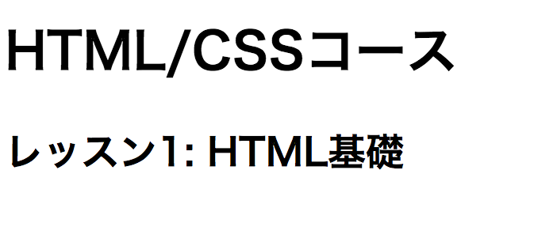
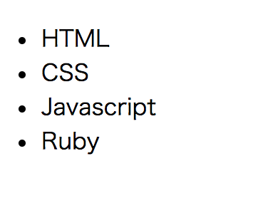
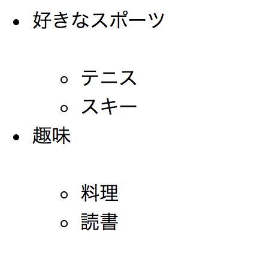
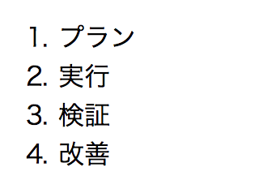
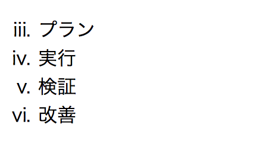
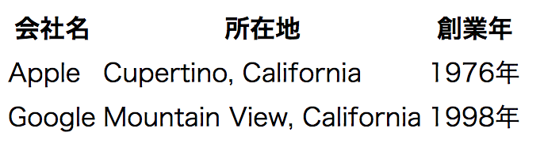

```
ステータス: 公開
タイプ: 学習教材
```

# 初めてのHTML

## 目的

- HTMLの基本を理解する。
- HTMLファイルの作成方法を知る。
- 基本的なHTML文が書けるようになる。

## HTMLとは

HTMLはマークアップ言語と呼ばれる言語の一つで、全てのWebサイトはプログラミング言語などの処理を通して最終的にこのHTMLで表現されます。HTMLで書かれたファイルのことを**HTML文書**と呼びます。HTML文書は以下で述べる**HTML要素**が組み合わさって出来ています。

## HTMLファイルを作成する

HTML文書は`.html`という拡張子で保存します。また一般的にWebサイトのトップページを**インデックスページ**と呼ぶため、一番最初に開かれるべきファイルを`index.html`と命名するのが慣習となっています。

## HTMLファイルの命名規則

HTMLファイル名は大文字小文字の区別がありません。そのため打ち間違いを防ぐため原則全ての文字をアルファベットの小文字で入力するのが慣例となっています。日本語を使うと無駄なトラブルが発生する原因となるためアルファベットのみを使ってください。また複数の単語を使う場合は`_(アンダースコア)`または`-(ハイフン)`を利用し、スペースは入れません。

**良くない例:**

- `テスト.html`
- `practice html.html`
- `Sample.html`

**良い例**

- `test.html`
- `practice_html.html`

## HTMLファイルをブラウザで開く

HTML文書が実際にブラウザ上でどう見えるかを知りたい場合は、HTMLファイルをブラウザのアイコン上にドラッグ&ドロップすると簡単です。またHTMLファイルを右クリックして、ファイルを開くアプリケーションで"Chrome"や"Firefox"などのブラウザを選ぶことでも同じようにブラウザ上で確認することが出来ます。


## HTML要素
一つのHTML要素は'<'と'>'のカギ括弧で囲まれた**タグ**と呼ばれる部分と、**コンテンツ**で構成されます。</p>のように`/`を含む要素は終了タグと呼ばれHTML要素の終わりを表します。逆にそれを含まないタグを`開始タグ`と呼びHTML要素の開始を表します。

```html
<p>CodeGrit is fun!</p>
```

上記の例では`<p>`の部分が**開始タグ**、「CodeGrit is Fun!」の部分が**コンテンツ**、`</p>`の部分が**終了タグ**です。


### 要素のネスト
コンテンツにあたる部分には次のように別のHTML要素を入れることも出来ます。要素の中に別の要素を挟むことを**ネスト**と呼びます。またこの時、ネストされている要素のことをネストしている要素の**子要素**と呼びます。ネストしている要素はネストされている要素の**親要素**と呼びます。

```html
<div>
  <p>CodeGrit is Fun!</p>
</div>
```

上記の例では`<div>`というHTML要素の中に`<p>CodeGrit is Fun</p>`という別のHTML要素がネストされています。

### ブロック要素とインライン要素

HTML要素は通常**ブロック要素**と**インライン要素**に分けることが出来ます。ブロック要素は親要素が占めている領域(ブロック)と同一の領域を占めます。ブラウザは通常このブロック要素を新しい行に表示します。インライン要素はブロック要素と違い、その要素が示す空間だけを占めます。

**ブロック要素の例:** `<div>, <h1>-<h6>, <p>`

**インライン要素の例:** `<span>, <a>, <b>, <strong>, `

例:

```html
<div>ブロック要素1</div>
<div>ブロック要素2</div>
<div>ブロック要素3</div>
<span>インライン要素1</span>
<span>インライン要素2</span>
<span>インライン要素3</span>
```


### 属性とは

同じ一つのタグに、属性を追加することで意味を追加することが出来ます。

```html
<div class="food">
  ラーメン
</div>
```

例えば、上記ではdivというタグに`class="food"`という属性を追加することでコンテンツの部分が「食べ物」を表す、という意味合いを与えています。この属性はCSSやJavascriptで同じ属性のものを装飾したり、動かしたりする時にも使われます。

## HTML文書の構造

HTML文書は基本的に以下の構造で記述されます。以下の例のように階層構造を書く時は、スペースを空けて階層になつていることが分かりやすくするのが慣例です。スペースは2文字あるいは4文字が一般的です。このスペースの文字数は*2文字と決めたら必ず全箇所2文字にする*のが慣例です。そうしなければ他のエンジニアが見た時に混乱するためです。

```html
<!DOCTYPE HTML>
<html>
  <head></head>
  <body</body>>
</html>
```

### 宣言文
`<!DOCTYPE HTML>`の部分は**宣言文**と呼ばれ、その文書が「HTML5」で書かれていることを明示しています。以前のバージョンを表現するときは別の文書宣言の書き方をしますが、HTML5のみが現在は通常使われるためこのチュートリアルでは詳しく触れません。

### html

`<html>要素`は、ページ内の全ての要素を囲むために使われ、ルート要素と呼ばれます。

### head

`<head>要素`は、複数のメタ要素を含み、外部にあるCSSやJavascriptのファイルを読み込むために使われる他、Googleなどの検索エンジンに表示させる、ページタイトルや概要などを記述する、などの目的で利用されます。詳しくは以下の「Headとメタ要素」の項目で解説します。

### body
<body>要素には、実際にブラウザ上に表示する内容を記述します。

## Headとメタ要素

```html
<head>
  <meta charset="utf-8">
  <title>HTML/CSS入門</title>
  <meta name="description" content="HTML/CSS入門コースでは、HTMLとCSSの基礎、リスポンシブデザインなどを学び、Webページを自由にデザイン出来るようになることを目的としたコースです
  。">
  <meta property="og:site_name" content="CodeGrit">
  <meta name="keywords" >
  <meta http-equiv="X-UA-Compatible" content="IE=edge,chrome=1">
  <link href="style.css" media="all" rel="stylesheet" type="text/css">
  <script type="text/javascript" async src="empty.js"></script>
</head>
```

### charset

```html
<meta charset="utf-8">
```

charsetはドキュメントの文字コードを設定するために利用します。日本語をHTML文書内で利用する場合charsetを設定しないとブラウザによっては文字化けが起こります。その為`utf-8`を設定してこれを防ぐ必要があります。

### title
```html
<title>HTML/CSS入門</title>
```

titleはその名の通りドキュメントのタイトルを設定するために利用します。GoogleやYahooで検索した時に表示されるページタイトルにも利用されます。


### description
```html
<meta name="description" content="HTML/CSS入門コースでは、HTMLとCSSの基礎、リスポンシブデザインなどを学び、Webページを自由にデザイン出来るようになることを目的としたコースです
  。">
```

GoogleやYahooなどで検索を行った際に検索結果にはタイトルと概要(description)が表示されます。この概要を設定するためにこのdescriptionタグを利用します。

### css/javascriptへのリンク

```html
<link href="style.css" media="all" rel="stylesheet" type="text/css">
<script type="text/javascript" async src="empty.js"></script>
```

HTML文書には直接JavascriptやCSSを埋め込むことも出来ますが、これは管理が大変なことからアンチパターン(避けるべきパターン)とされています。通常はJavascriptやCSSはHTMLとは別で保存し、上記のようにそのファイルを読み込んで来るのが一般的です。ファイルの場所の指定方法などは次回のレッスンで説明します。


## Body
### 文書構造

新聞、雑誌などのメディアでは通常、タイトル、サブタイトルが来た後にその内容を説明していきます。Webサイト上でこれを表現するためHTMLでは様々なタグを利用します。

### `<h1>-<h6>`

`<h1>-<h6>`要素はHTML文書内のセクションのタイトルとして利用されます。`<h1>`が最も重要なタイトルに利用され、`<h2>-<h6>`はそれよりも重要性の低いタイトルに利用されます。h2-h6はサブヘディングと呼ばれることも多いです。

例:

```html
<h1>HTML/CSSコース</h1>
<h2>レッスン1: HTML基礎</h2>
```



### `<p>`

`<p>`(**P**aragraph)要素は、通常の文章を書く場合に利用されます。

例:
```html
<p>この要素は、通常の文章を書く場合に利用されます。</p>
```


### `<ul>`

`<ul>`(**U**nordered **L**ist)要素は順序のないリストを表現するために利用します。各項目を記述するには`<li>`要素をネストします。

例:

```html
<ul>
  <li>HTML</li>
  <li>CSS</li>
  <li>Javascript</li>
  <li>Ruby</li>
</ul>
```



`<ul>`要素内に`<ul>`要素をネストすることも可能です。

例:

```html
<ul>
  <li>好きなスポーツ</li>
  <ul>
    <li>テニス</li>
    <li>スキー</li>
  </ul>
  <li>趣味</li>
  <ul>
    <li>料理</li>
    <li>読書</li>
  </ul>
</ul>
```



[サンプルコード](./samples/ul_sample.html)

### `<ol>`
`<ol>`(**O**rdered **L**ist)要素は順序のあるリストを表現するために利用します。各項目を記述するには`<li>`要素をネストします。`<ul>`要素と同様に`<ol>`要素内に`<ol>`要素をネストすることも可能です。

例:
```html
<ol>
  <li>プラン</li>
  <li>実行</li>
  <li>検証</li>
  <li>改善</li>
</ol>
```


[サンプルコード](./samples/ol_sample.html)

また`type="i"`という属性を追加することでローマ数字を使うことが出来、`start`という属性を追加すると開始する数字を変更出来ます。

例:
```html
<ol type="i" start="3">
  <li>プラン</li>
  <li>実行</li>
  <li>検証</li>
  <li>改善</li>
</ol>
```



### `<b>`,`<i>`,`<u>`

`<b>`(**B**old)要素は文字を太字にしたい時、`<i>`(**I**talic)要素は文字をイタリック体にしたい時、`<u>`(**U**nderlined)要素は文字に下線を入れたい時に利用します。

例:
```html
<p><b>これはボールド体です。</b></p>
<p><i>これはイタリック体です。</i></p>
<p><u>これは下線付きです。</u></p>
```


[サンプルコード](./samples/b_i_u_comparison.html)


### `<strong>` - ストロング
`<b>`と同様に文字を太字にします。

### `<em>` - エンファシス
`<b>`、`<strong>`と同様に文字を太字にします。

### セマンティックスタグとは

上記の、`<strong>`と`<em>`を見て、同じように太字にするのなら`<b>`だけで良いのでは、と思った方もいるかと思います。なぜこのように3つの要素があるかというと、タグにはセマンティックタグと呼ばれるタグがあるためです。セマンティクスを日本語に直訳すると「意味論」で、このセマンティックタグはコンテンツの意味合いをより正確に表現するために利用します。セマンティックタグには例えば、ナビゲーションを表す`<nav>`、動画を表す`<video>`、ヘッダーを表す`<header>`、メインコンテンツを表す`<main>`などがあります。

### `<strong>, <em>, <b>`の違い

この3つの要素の内、`<strong>`と`<em>`はセマンティックタグです。この内emについては一つの文章で強調したい要素を示すのに使います。例えば、「僕はラーメンが好きです」という文章があるとします。ここでラーメンを強調するのと僕を強調するのでは若干文章の意味合いが違ってきます。ラーメンを強調すると、好きなものはそれだけというようなイメージになるのに対し、僕はを強調すると他の人は別の選択肢を持っていることを暗示出来ます。`<storng>`タグは、これとは違い文章の中の重要な要素を示すために利用します。


| タグ          | 種類           | 使い所  |
| ------------- |:-------------:| -----:|
| `<strong>`     | セマンティックタグ | キーワード |
| `<em>`    | セマンティックタグ      |   強調 |
| `<b>`     | スタイルタグ     | 非推奨 |

### HTML5ではセマンティクスタグ利用を推奨

実は`<b>`タグはHTML5では非推奨となりました。変わりに意味合いを表せる`<strong>`や`<em>`を使うことが推奨されています。例えばメインコンテンツも以前は`<div class="main">`という書き方が主流でしたが、HTML5では`<main>`というタグを使います。HTMLを書く時はセマンティクスを意識するのが良いでしょう。

## セマンティクスタグとページ構造

多くのWebサイトは一般に以下のような構造をしています。


- ヘッダー

ヘッダーには`<header>`というセマンティクスタグを利用します。ヘッダーにはロゴやサイトのサブタイトルなどを配置するのが一般的です。

- ナビゲーションバー

ナビゲーションバーには`<nav>`というセマンティクスタグを利用します。ナビゲーションバーではサイト内の他の重要なページへのリンクや、そのページ内のセクションへのリンクを貼ります。ナビゲーションバーが2つ以上存在する場合や、サイトの右や左に配置されることもよくあります。こうした場合は`<nav class="main">`、 `<nav class="secondary">`、`<nav class="side">`というようにclass属性を利用して、それぞれの役割を明示します。

- メインコンテンツ

メインコンテンツには、`<main>`というセマンティクスタグを利用します。ここには、そのページの主要コンテンツを表示します。

- サイドバー

サイドバーには`<aside>`というセマンティクスタグを利用します。サイドバーでは、例えばブログであれば、自己紹介やブログの紹介、過去の記事の一覧などを表示します。

- フッター

フッターには`<footer>`というセマンティクスタグを利用します。ここには、例えばそのサイト内のリンクを記載したり、著作権表示などをします。


## ハイパーリンク

### ハイパーリンクとは
ハイパーリンクとはハイパーテキスト(HTML文書のこと)上に存在するリンクのことをいいます。ブラウザを利用している方ならリンクは日常的に使い慣れているはずです。ハイパーリンクはURLを通じて他のサイトへ移動するときだけでなく、同じページ内の別の場所へ移動する際にも利用することが出来ます。また外部のCSSファイルやJavascriptファイルもこのハイパーリンクを通じて読み込むことが出来ます。

### `<a>`
アンカータグを利用することで、外部のサイトや同じドキュメント内の他の場所へハイパーリンクを貼ることが出来ます。リンク先の場所は`href`という属性を利用して記述します。

例1:
```html
<a href="https://google.com">Google</a>
```

例2:
```html
<a href="./other_page.html">別のページ</a>
```


### 相対パスと絶対パス

例えば指定したファイルが別のフォルダーの中に入っていたりする場合にどうやってその場所を指定するでしょう。その場所までの道のりのことをパス(Path)と呼びます。例えば、自分のサイトのURLが"http://mysite.com"だったとしましょう。今いる場所が"http://mysite.com/index"で、ここから"http://mysite.com/test/page"というページに移動するとします。この時、絶対パスは"http://mysite.com/test/page"となります。これを今いる場所を基準に考えるパスが相対パスです。例えば、今いる場所のことを相対パスでは`"./"`で表し、一段上のディレクトリのことを`"../"`で表します。同様に2段階上だと`"../../"`、3段階上なら`"../../../"`で表します。上記のURLの例だと`"./test/page"`で指定のページを表すことが出来ます。また、URLの場合は何もドメイン(ここでは"http://mysite.com")を書かなくてもブラウザがそのドメインからの相対パスを利用してくれるため、`href="test/page"`と書くことも出来ます。

| 種類          | 例 |
| ------------- | -----:|
| 相対パス     | "http://example.com/index" |
| 接待パス   | "/index" |

## 画像

### 基本的な画像埋め込み方法

HTML文書に画像を追加するには``要素を利用します。また`src属性`に画像への絶対パス、または相対パスを書く必要があります。srcはsourceの略です。また、``要素は空要素と呼ばれる要素の一つで、終了タグを使いません。

以下の例では同じディレクトリー内にある`sample.png`というファイルを相対パスを利用して指定しています。

例:
```html

```


### Alt属性

インターネットスピードが遅い場合や、HTMLメールで画像非表示と設定されている場合があります。このような時に、画像の説明文をAlt属性で記載しておくと、画像の代わりにこの文章が表示されます。Altは"Alternative Text"の略で、日本語でそのまま「代わりの文書」という意味です。またGoogleなどの検索エンジンは画像を見ることが出来ないのでこのAltタグでコンテンツを判断します。

例:
```html

```

画像が読み込めない場合、次の画像のようにalt内のテキストが表示されます。


### width属性とheight属性

ユーザーが画像が見れない場合やまだ画像が読み込み中の場合、あらかじめ画像の高さ(height)と広さ(width)を指定しておくことで、例えば画像が読み込まれた瞬間にクリックして、思っていたのと違う場所をクリックしてしまう、というような体験を防ぐことが出来ます。(画像を2つ貼ること)

また、画像を実際のサイズより小さく表示したい場合や、大きく表示したい場合にもこの2つの属性を利用出来ます。但し、画像を大きくすると画像がボケて見えたり、また高さと幅の比率を変えてしまうと画像が歪んで見えてしまうので注意が必要です。

例:
```html

```


## HTMLテーブル

行と列で表される表形式のデータのことをテーブルと呼びます。テーブルををHTML文書内で表示したい場合は、以下のように`<table>`要素内に`<tr>`要素をネストし、更にその中に`<th>`または`<td>`要素をネストして記述します。

```html
<table>
  <tr>
    <th>会社名</th>
    <th>所在地</th>
    <th>創業年</th>
  </tr>
  <tr>
    <td>Apple</td>
    <td>Cupertino, California</td>
    <td>1976年</td>
  </tr>
  <tr>
    <td>Google</td>
    <td>Mountain View, California</td>
    <td>1998年</td>
  </tr>
</table>
```



[サンプルコード](./samples/table.html)

### `<table>`
`<table>`要素はテーブルであることを明示するために書きます。

### `<tr>`
`<tr>`要素はTable Rowの略でテーブルの行を表します。

### `<th>`
`<th>`要素はTable Headerの略でテーブルのヘッダーであることを示しています。

### `<td>`
`<td>`要素はTable Dataの略で、表内のそれぞれの枠に入るデータを示しています。

## HTMLファイル内にコメントを書く

HTMLファイル内には、備考用のコメントを書くことや、書いたコードを一次的に反映されないようにする(コメントアウト)ことが出来ます。コメントを書くにはコメントにしたい部分を`<!-- -->`で囲みます。

例1: 1行でコメントを書く

```html
<body>
  <!-- これはコメントです。 -->
</body>
```

例2: 複数行でコメントを書く

```html
<body>
  <!--
    行1
    行2
    行3
   -->
</body>
```


## 色々なWebサイトのHTMLを見てみる

Google ChromeにはDevToolsという開発者向けの機能がついています。この機能を利用するとWebサイトのHTMLやCSSなどを見ることが出来ます。実際に有名サイトでどのようにHTMLが書かれているのか見てみると、勉強になるはずです。

[Chrome DevToolsの使い方](https://developers.google.com/web/tools/chrome-devtools/?hl=ja)

例えば、メルカリのHTMLを見てみましょう。

[メルカリ](https://www.mercari.com/jp/)


DevToolsを立ち上げると以下のような画面が出てきます。


この出てきた画面の左側の部分がHTMLです。いかがでしょうか。複雑ではあるもののどんなサイトであればHTMLで出来ていることが分かるはずです。

## チャレンジ

[チャレンジ1](./challenge/README.md)

## 更に学ぼう

### 動画で学ぶ
[ドットインストール HTML入門](https://dotinstall.com/lessons/basic_html_v3)

### 記事で学ぶ
[HTMLの基本 - MDN](https://developer.mozilla.org/ja/docs/Learn/Getting_started_with_the_web/HTML_basics)
