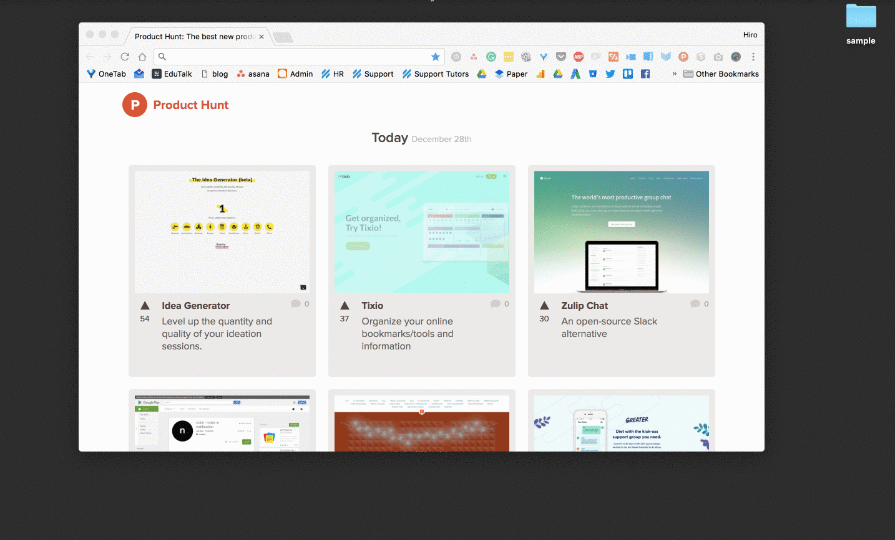

## HTMLとは

HTMLはマークアップ言語と呼ばれる言語の一つで、全てのWebサイトはプログラミング言語などの処理を通して最終的にこのHTMLで表現されます。HTMLで書かれたファイルのことを**HTML文書**と呼びます。HTML文書は以下で述べる**HTML要素**が組み合わさって出来ています。

## HTMLファイルを作成する

HTML文書は`.html`という拡張子で保存します。また一般的にWebサイトのトップページを**インデックスページ**と呼ぶため、一番最初に開かれるべきファイルを`index.html`と命名するのが慣習となっています。

## HTMLファイルの命名規則

HTMLファイル名は大文字小文字の区別がありません。そのため打ち間違いを防ぐため原則全ての文字をアルファベットの小文字で入力するのが慣例となっています。日本語を使うと無駄なトラブルが発生する原因となるためアルファベットのみを使ってください。また複数の単語を使う場合は`_(アンダースコア)`または`-(ハイフン)`を利用し、スペースは入れません。

**良くない例:**

- `テスト.html`
- `practice html.html`
- `Sample.html`

**良い例**

- `test.html`
- `practice_html.html`

## HTMLファイルをブラウザで開く

HTML文書が実際にブラウザ上でどう見えるかを知りたい場合は、HTMLファイルをブラウザのアイコン上にドラッグ&ドロップすると簡単です。またHTMLファイルを右クリックして、ファイルを開くアプリケーションで"Chrome"や"Firefox"などのブラウザを選ぶことでも同じようにブラウザ上で確認することが出来ます。

