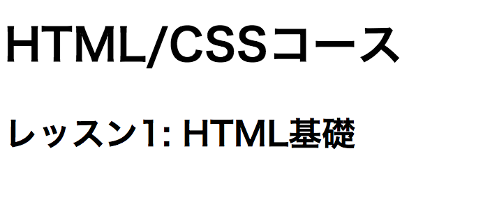
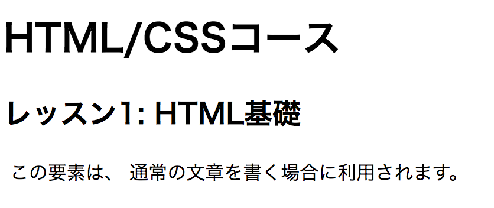
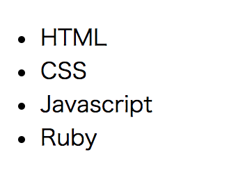
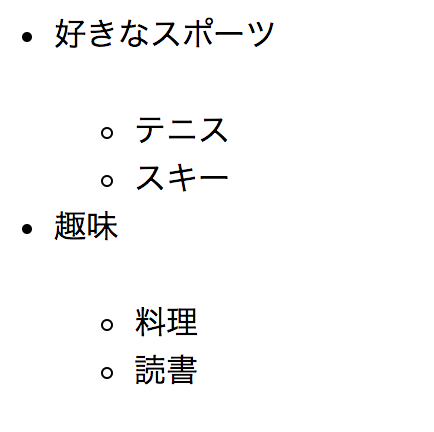
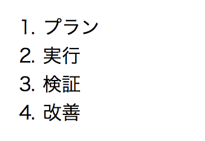
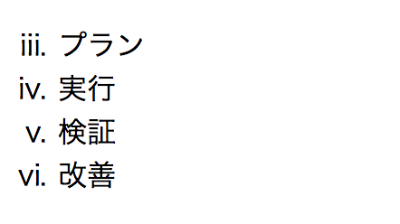
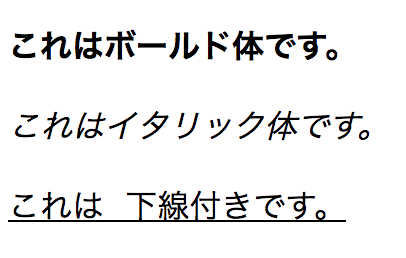
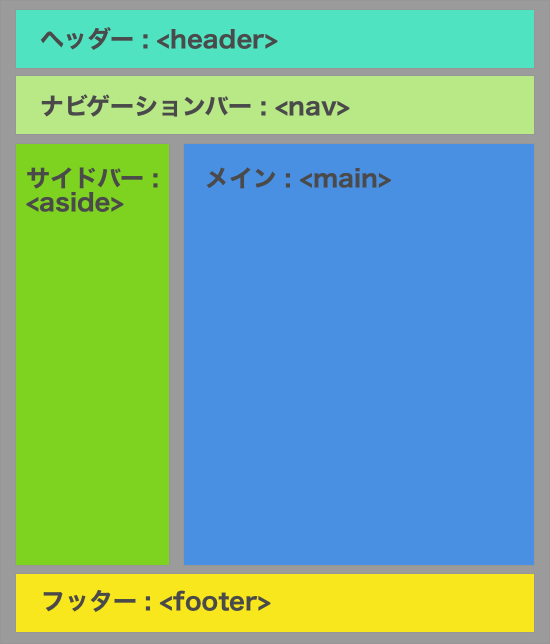

## Headとメタ要素

```html
<head>
  <meta charset="utf-8">
  <title>HTML/CSS入門</title>
  <meta name="description" content="HTML/CSS入門コースでは、HTMLとCSSの基礎、リスポンシブデザインなどを学び、Webページを自由にデザイン出来るようになることを目的としたコースです
  。">
  <meta property="og:site_name" content="CodeGrit">
  <meta name="keywords" >
  <meta http-equiv="X-UA-Compatible" content="IE=edge,chrome=1">
  <link href="style.css" media="all" rel="stylesheet" type="text/css">
  <script type="text/javascript" async src="empty.js"></script>
</head>
```

### charset

```html
<meta charset="utf-8">
```

charsetはドキュメントの文字コードを設定するために利用します。日本語をHTML文書内で利用する場合charsetを設定しないとブラウザによっては文字化けが起こります。その為`utf-8`を設定してこれを防ぐ必要があります。

### title

```html
<title>HTML/CSS入門</title>
```

titleはその名の通りドキュメントのタイトルを設定するために利用します。GoogleやYahooで検索した時に表示されるページタイトルにも利用されます。


### description

```html
<meta name="description" content="HTML/CSS入門コースでは、HTMLとCSSの基礎、リスポンシブデザインなどを学び、Webページを自由にデザイン出来るようになることを目的としたコースです
  。">
```

GoogleやYahooなどで検索を行った際に検索結果にはタイトルと概要(description)が表示されます。この概要を設定するためにこのdescriptionタグを利用します。

### css/javascriptへのリンク

```html
<link href="style.css" media="all" rel="stylesheet" type="text/css">
<script type="text/javascript" async src="empty.js"></script>
```

HTML文書には直接JavascriptやCSSを埋め込むことも出来ますが、これは管理が大変なことからアンチパターン(避けるべきパターン)とされています。通常はJavascriptやCSSはHTMLとは別で保存し、上記のようにそのファイルを読み込んで来るのが一般的です。ファイルの場所の指定方法などは次回のレッスンで説明します。

## Body

### 文書構造

新聞、雑誌などのメディアでは通常、タイトル、サブタイトルが来た後にその内容を説明していきます。Webサイト上でこれを表現するためHTMLでは様々なタグを利用します。

### `<h1>-<h6>`

`<h1>-<h6>`要素はHTML文書内のセクションのタイトルとして利用されます。`<h1>`が最も重要なタイトルに利用され、`<h2>-<h6>`はそれよりも重要性の低いタイトルに利用されます。h2-h6はサブヘディングと呼ばれることも多いです。

例:

```html
<h1>HTML/CSSコース</h1>
<h2>レッスン1: HTML基礎</h2>
```



### `<p>`

`<p>`(**P**aragraph)要素は、通常の文章を書く場合に利用されます。

例:

```html
<p>この要素は、通常の文章を書く場合に利用されます。</p>
```



### `<ul>`

`<ul>`(**U**nordered **L**ist)要素は順序のないリストを表現するために利用します。各項目を記述するには`<li>`要素をネストします。

例:

```html
<ul>
  <li>HTML</li>
  <li>CSS</li>
  <li>Javascript</li>
  <li>Ruby</li>
</ul>
```



`<ul>`要素内に`<ul>`要素をネストすることも可能です。

例:

```html
<ul>
  <li>好きなスポーツ</li>
  <ul>
    <li>テニス</li>
    <li>スキー</li>
  </ul>
  <li>趣味</li>
  <ul>
    <li>料理</li>
    <li>読書</li>
  </ul>
</ul>
```



### `<ol>`

`<ol>`(**O**rdered **L**ist)要素は順序のあるリストを表現するために利用します。各項目を記述するには`<li>`要素をネストします。`<ul>`要素と同様に`<ol>`要素内に`<ol>`要素をネストすることも可能です。

例:
```html
<ol>
  <li>プラン</li>
  <li>実行</li>
  <li>検証</li>
  <li>改善</li>
</ol>
```



また`type="i"`という属性を追加することでローマ数字を使うことが出来、`start`という属性を追加すると開始する数字を変更出来ます。

例:

```html
<ol type="i" start="3">
  <li>プラン</li>
  <li>実行</li>
  <li>検証</li>
  <li>改善</li>
</ol>
```



### `<b>`,`<i>`,`<u>`

`<b>`(**B**old)要素は文字を太字にしたい時、`<i>`(**I**talic)要素は文字をイタリック体にしたい時、`<u>`(**U**nderlined)要素は文字に下線を入れたい時に利用します。

例:

```html
<p><b>これはボールド体です。</b></p>
<p><i>これはイタリック体です。</i></p>
<p><u>これは下線付きです。</u></p>
```



### `<strong>` - ストロング

`<b>`と同様に文字を太字にします。

### `<em>` - エンファシス

`<b>`、`<strong>`と同様に文字を太字にします。

### jsFiddleでも試してみよう

読むだけでなく実際に試してみることで、より正確に早く知識が身につきます。jsFiddleのエディタ上で自分でも試してみましょう。

<iframe width="100%" height="300" src="//jsfiddle.net/codegrit_hiro/5sqdfy1w/embedded/html,result/dark/" allowfullscreen="allowfullscreen" allowpaymentrequest frameborder="0"></iframe>

### セマンティックスタグとは

上記の、`<strong>`と`<em>`を見て、同じように太字にするのなら`<b>`だけで良いのでは、と思った方もいるかと思います。なぜこのように3つの要素があるかというと、タグにはセマンティックタグと呼ばれるタグがあるためです。セマンティクスを日本語に直訳すると「意味論」で、このセマンティックタグはコンテンツの意味合いをより正確に表現するために利用します。セマンティックタグには例えば、ナビゲーションを表す`<nav>`、動画を表す`<video>`、ヘッダーを表す`<header>`、メインコンテンツを表す`<main>`などがあります。

### `<strong>, <em>, <b>`の違い

この3つの要素の内、`<strong>`と`<em>`はセマンティックタグです。この内emについては一つの文章で強調したい要素を示すのに使います。例えば、「僕はラーメンが好きです」という文章があるとします。ここでラーメンを強調するのと僕を強調するのでは若干文章の意味合いが違ってきます。ラーメンを強調すると、好きなものはそれだけというようなイメージになるのに対し、僕はを強調すると他の人は別の選択肢を持っていることを暗示出来ます。`<storng>`タグは、これとは違い文章の中の重要な要素を示すために利用します。


| タグ          | 種類           | 使い所  |
| ------------- |:-------------:| -----:|
| `<strong>`     | セマンティックタグ | キーワード |
| `<em>`    | セマンティックタグ      |   強調 |
| `<b>`     | スタイルタグ     | 非推奨 |

### HTML5ではセマンティクスタグ利用を推奨

実は`<b>`タグはHTML5では非推奨となりました。変わりに意味合いを表せる`<strong>`や`<em>`を使うことが推奨されています。例えばメインコンテンツも以前は`<div class="main">`という書き方が主流でしたが、HTML5では`<main>`というタグを使います。HTMLを書く時はセマンティクスを意識するのが良いでしょう。

## セマンティクスタグとページ構造

多くのWebサイトは一般に以下のような構造をしています。



- ヘッダー

ヘッダーには`<header>`というセマンティクスタグを利用します。ヘッダーにはロゴやサイトのサブタイトルなどを配置するのが一般的です。

- ナビゲーションバー

ナビゲーションバーには`<nav>`というセマンティクスタグを利用します。ナビゲーションバーではサイト内の他の重要なページへのリンクや、そのページ内のセクションへのリンクを貼ります。ナビゲーションバーが2つ以上存在する場合や、サイトの右や左に配置されることもよくあります。こうした場合は`<nav class="main">`、 `<nav class="secondary">`、`<nav class="side">`というようにclass属性を利用して、それぞれの役割を明示します。

- メインコンテンツ

メインコンテンツには、`<main>`というセマンティクスタグを利用します。ここには、そのページの主要コンテンツを表示します。

- サイドバー

サイドバーには`<aside>`というセマンティクスタグを利用します。サイドバーでは、例えばブログであれば、自己紹介やブログの紹介、過去の記事の一覧などを表示します。

- フッター

フッターには`<footer>`というセマンティクスタグを利用します。ここには、例えばそのサイト内のリンクを記載したり、著作権表示などをします。
