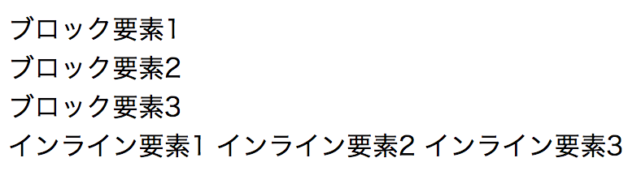

## HTML要素

一つのHTML要素は'<'と'>'のカギ括弧で囲まれた**タグ**と呼ばれる部分と、**コンテンツ**で構成されます。</p>のように`/`を含む要素は終了タグと呼ばれHTML要素の終わりを表します。逆にそれを含まないタグを`開始タグ`と呼びHTML要素の開始を表します。

```html
<p>CodeGrit is fun!</p>
```

上記の例では`<p>`の部分が**開始タグ**、「CodeGrit is Fun!」の部分が**コンテンツ**、`</p>`の部分が**終了タグ**です。


### 要素のネスト
コンテンツにあたる部分には次のように別のHTML要素を入れることも出来ます。要素の中に別の要素を挟むことを**ネスト**と呼びます。またこの時、ネストされている要素のことをネストしている要素の**子要素**と呼びます。ネストしている要素はネストされている要素の**親要素**と呼びます。

```html
<div>
  <p>CodeGrit is Fun!</p>
</div>
```

上記の例では`<div>`というHTML要素の中に`<p>CodeGrit is Fun</p>`という別のHTML要素がネストされています。

### ブロック要素とインライン要素

HTML要素は通常**ブロック要素**と**インライン要素**に分けることが出来ます。ブロック要素は親要素が占めている領域(ブロック)と同一の領域を占めます。ブラウザは通常このブロック要素を新しい行に表示します。インライン要素はブロック要素と違い、その要素が示す空間だけを占めます。

**ブロック要素の例:** `<div>, <h1>-<h6>, <p>`

**インライン要素の例:** `<span>, <a>, <b>, <strong>, `

例:

```html
<div>ブロック要素1</div>
<div>ブロック要素2</div>
<div>ブロック要素3</div>
<span>インライン要素1</span>
<span>インライン要素2</span>
<span>インライン要素3</span>
```



### 属性とは

同じ一つのタグに、属性を追加することで意味を追加することが出来ます。

```html
<div class="food">
  ラーメン
</div>
```

例えば、上記ではdivというタグに`class="food"`という属性を追加することでコンテンツの部分が「食べ物」を表す、という意味合いを与えています。この属性はCSSやJavascriptで同じ属性のものを装飾したり、動かしたりする時にも使われます。

## HTML文書の構造

HTML文書は基本的に以下の構造で記述されます。以下の例のように階層構造を書く時は、スペースを空けて階層になつていることが分かりやすくするのが慣例です。スペースは2文字あるいは4文字が一般的です。このスペースの文字数は*2文字と決めたら必ず全箇所2文字にする*のが慣例です。そうしなければ他のエンジニアが見た時に混乱するためです。

```html
<!DOCTYPE HTML>
<html>
  <head></head>
  <body</body>>
</html>
```

### 宣言文
`<!DOCTYPE HTML>`の部分は**宣言文**と呼ばれ、その文書が「HTML5」で書かれていることを明示しています。以前のバージョンを表現するときは別の文書宣言の書き方をしますが、HTML5のみが現在は通常使われるためこのチュートリアルでは詳しく触れません。

### html

`<html>要素`は、ページ内の全ての要素を囲むために使われ、ルート要素と呼ばれます。

### head

`<head>要素`は、複数のメタ要素を含み、外部にあるCSSやJavascriptのファイルを読み込むために使われる他、Googleなどの検索エンジンに表示させる、ページタイトルや概要などを記述する、などの目的で利用されます。詳しくは以下の「Headとメタ要素」の項目で解説します。

### body
<body>要素には、実際にブラウザ上に表示する内容を記述します。