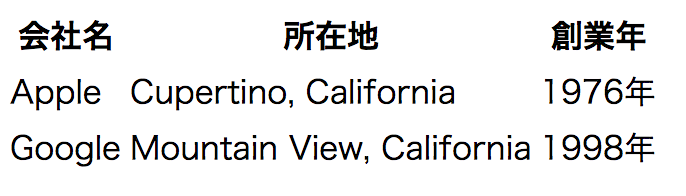
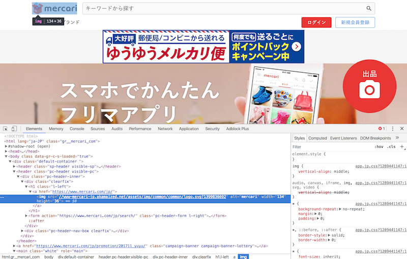

## ハイパーリンク

### ハイパーリンクとは
ハイパーリンクとはハイパーテキスト(HTML文書のこと)上に存在するリンクのことをいいます。ブラウザを利用している方ならリンクは日常的に使い慣れているはずです。ハイパーリンクはURLを通じて他のサイトへ移動するときだけでなく、同じページ内の別の場所へ移動する際にも利用することが出来ます。また外部のCSSファイルやJavascriptファイルもこのハイパーリンクを通じて読み込むことが出来ます。

### `<a>`
アンカータグを利用することで、外部のサイトや同じドキュメント内の他の場所へハイパーリンクを貼ることが出来ます。リンク先の場所は`href`という属性を利用して記述します。

例1:
```html
<a href="https://google.com">Google</a>
```

例2:
```html
<a href="./other_page.html">別のページ</a>
```


### 相対パスと絶対パス

絶対パスとは現在いる位置に関わらない、ファイルの絶対的な位置のことを言います。これに対して相対パスとは現在開いているファイルから、別のファイルへの相対的な位置を表します。

例えば、東京タワーの住所(絶対パス)は「東京都港区芝公園内20号地」です。しかし、既に最寄りまで来ているなら東京タワーの相対パスは、「向かいの信号を渡って左」という風に言えます。

また、絶対パスも絶対とつきつつ相対的なものだったりします。例えば、日本に住んでいる人だったら「東京都...」のように住所を言いますが、東京に住んでる人だったら「港区...」のように言ったりします。逆に国外にいる人なら「日本国東京都...」みたいな言い方をします。このように人によって基準となる場所が違います。

パソコンも実は同じで、ログインしているユーザーごとに基準となる場所が違っていて、この基準の場所を専門用語で**ルートディレクトリ**といいます。ルートディレクトリは`~/`というショートカットが用意されています。

パソコン上のファイルの位置は、このルートディレクトリからの位置を示す絶対パス、あるいは、あるファイルから見たときの相対パスで表せます。

相対パスの場合は、現在いる場所のことを`./`で表します。

例えば、ルートディレクトリ上に「アルバム」という写真がたくさん入ったファイルがあるとします。その中に「沖縄旅行」というフォルダがあって、「国際通り.jpg」というファイルがあるとします。この時に、沖縄旅行というフォルダを既に開いているとすると、「国際通り.jpg」ファイルは絶対パスと相対パスで次のように書けます。

絶対パス - `~/アルバム/沖縄旅行/国際通り.jpg`
沖縄旅行フォルダからの相対パス - `./国際通り.jpg`

また、`./`は現在いる場所を表しますが、`../`、`../../`のようにすることで上の改装、さらにその上の階層とフォルダをさかのぼることが出来ます。

例えばですが、アルバムフォルダの中に更に「ベトナム旅行」というフォルダがあり、その中に「ホイアン.jpg」というファイルがあるとします。今沖縄旅行フォルダを開いているとするとこのホイアン.jpgの相対パスは以下のようになります。

絶対パス - `~/アルバム/ベトナム旅行/ホイアン.jpg`
沖縄旅行フォルダからの相対パス - `../ベトナム旅行/ホイアン.jpg`

沖縄旅行の一つ上にあるアルバムフォルダの位置を`../`で示して、そこから「ホイアン.jpg」までのパスを指定しています。

実は、インターネットですと例えば、`google.com`というのもインターネット上の住所である`IPアドレス`を読みやすいように別の名前にしているものだったりします。(google.comのインターネット上の住所であるIPアドレスは`172.217.25.227`)

そのため、`https://mysite.com`のようなURLも一種の絶対パスと言えます。


| 種類          | 例 |
| ------------- | -----:|
| 絶対パス     | `http://example.com/`, `~/アルバム/ベトナム旅行/ホイアン.jpg` |
| 相対パス   | `./index.html`, `../ベトナム旅行/ホイアン.jpg` |

## 画像を扱う

### 基本的な画像埋め込み方法

HTML文書に画像を追加するには``要素を利用します。また`src属性`に画像への絶対パス、または相対パスを書く必要があります。srcはsourceの略です。また、``要素は空要素と呼ばれる要素の一つで、終了タグを使いません。

以下の例では同じディレクトリー内にある`sample.png`というファイルを相対パスを利用して指定しています。

例:
```html

```


### Alt属性

インターネットスピードが遅い場合や、HTMLメールで画像非表示と設定されている場合があります。このような時に、画像の説明文をAlt属性で記載しておくと、画像の代わりにこの文章が表示されます。Altは"Alternative Text"の略で、日本語でそのまま「代わりの文書」という意味です。またGoogleなどの検索エンジンは画像を見ることが出来ないのでこのAltタグでコンテンツを判断します。

例:
```html

```

画像が読み込めない場合、次の画像のようにalt内のテキストが表示されます。


### width属性とheight属性

ユーザーが画像が見れない場合やまだ画像が読み込み中の場合、あらかじめ画像の高さ(height)と広さ(width)を指定しておくことで、例えば画像が読み込まれた瞬間にクリックして、思っていたのと違う場所をクリックしてしまう、というような体験を防ぐことが出来ます。(画像を2つ貼ること)

また、画像を実際のサイズより小さく表示したい場合や、大きく表示したい場合にもこの2つの属性を利用出来ます。但し、画像を大きくすると画像がボケて見えたり、また高さと幅の比率を変えてしまうと画像が歪んで見えてしまうので注意が必要です。

例:
```html

```


## HTMLテーブル

行と列で表される表形式のデータのことをテーブルと呼びます。テーブルををHTML文書内で表示したい場合は、以下のように`<table>`要素内に`<tr>`要素をネストし、更にその中に`<th>`または`<td>`要素をネストして記述します。

```html
<table>
  <tr>
    <th>会社名</th>
    <th>所在地</th>
    <th>創業年</th>
  </tr>
  <tr>
    <td>Apple</td>
    <td>Cupertino, California</td>
    <td>1976年</td>
  </tr>
  <tr>
    <td>Google</td>
    <td>Mountain View, California</td>
    <td>1998年</td>
  </tr>
</table>
```



<iframe width="100%" height="300" src="//jsfiddle.net/codegrit_hiro/z5jrk27a/embedded/html,result/dark/" allowfullscreen="allowfullscreen" allowpaymentrequest frameborder="0"></iframe>

### `<table>`
`<table>`要素はテーブルであることを明示するために書きます。

### `<tr>`
`<tr>`要素はTable Rowの略でテーブルの行を表します。

### `<th>`
`<th>`要素はTable Headerの略でテーブルのヘッダーであることを示しています。

### `<td>`
`<td>`要素はTable Dataの略で、表内のそれぞれの枠に入るデータを示しています。

## HTMLファイル内にコメントを書く

HTMLファイル内には、備考用のコメントを書くことや、書いたコードを一次的に反映されないようにする(コメントアウト)ことが出来ます。コメントを書くにはコメントにしたい部分を`<!-- -->`で囲みます。

例1: 1行でコメントを書く

```html
<body>
  <!-- これはコメントです。 -->
</body>
```

例2: 複数行でコメントを書く

```html
<body>
  <!--
    行1
    行2
    行3
   -->
</body>
```

## 色々なWebサイトのHTMLを見てみる

Google ChromeにはDevToolsという開発者向けの機能がついています。この機能を利用するとWebサイトのHTMLやCSSなどを見ることが出来ます。実際に有名サイトでどのようにHTMLが書かれているのか見てみると、勉強になるはずです。

[Chrome DevToolsの使い方](https://developers.google.com/web/tools/chrome-devtools/?hl=ja)

例えば、メルカリのHTMLを見てみましょう。

[メルカリ](https://www.mercari.com/jp/)


DevToolsを立ち上げると以下のような画面が出てきます。



この出てきた画面の左側の部分がHTMLです。いかがでしょうか。複雑ではあるもののどんなサイトであればHTMLで出来ていることが分かるはずです。


## 更に学ぼう

### 動画で学ぶ
[ドットインストール HTML入門](https://dotinstall.com/lessons/basic_html_v3)

### 記事で学ぶ
[HTMLの基本 - MDN](https://developer.mozilla.org/ja/docs/Learn/Getting_started_with_the_web/HTML_basics)
