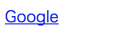
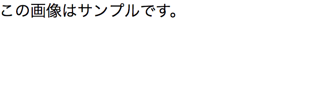

## ハイパーリンク

### ハイパーリンクとは
ハイパーリンクとはハイパーテキスト(HTML文書のこと)上に存在するリンクのことをいいます。ブラウザを利用している方ならリンクは日常的に使い慣れているはずです。ハイパーリンクはURLを通じて他のサイトへ移動するときだけでなく、同じページ内の別の場所へ移動する際にも利用することが出来ます。また外部のCSSファイルやJavascriptファイルもこのハイパーリンクを通じて読み込むことが出来ます。

### `<a>`
アンカータグを利用することで、外部のサイトや同じドキュメント内の他の場所へハイパーリンクを貼ることが出来ます。リンク先の場所は`href`という属性を利用して記述します。

例1:
```html
<a href="https://google.com">Google</a>
```

例2:
```html
<a href="./other_page.html">別のページ</a>
```



### 相対パスと絶対パス

例えば指定したファイルが別のフォルダーの中に入っていたりする場合にどうやってその場所を指定するでしょう。その場所までの道のりのことをパス(Path)と呼びます。例えば、自分のサイトのURLが"http://mysite.com"だったとしましょう。今いる場所が"http://mysite.com/index"で、ここから"http://mysite.com/test/page"というページに移動するとします。この時、絶対パスは"http://mysite.com/test/page"となります。これを今いる場所を基準に考えるパスが相対パスです。例えば、今いる場所のことを相対パスでは`"./"`で表し、一段上のディレクトリのことを`"../"`で表します。同様に2段階上だと`"../../"`、3段階上なら`"../../../"`で表します。上記のURLの例だと`"./test/page"`で指定のページを表すことが出来ます。また、URLの場合は何もドメイン(ここでは"http://mysite.com")を書かなくてもブラウザがそのドメインからの相対パスを利用してくれるため、`href="test/page"`と書くことも出来ます。

| 種類          | 例 |
| ------------- | -----:|
| 相対パス     | "http://example.com/index" |
| 接待パス   | "/index" |

## 画像

### 基本的な画像埋め込み方法

HTML文書に画像を追加するには``要素を利用します。また`src属性`に画像への絶対パス、または相対パスを書く必要があります。srcはsourceの略です。また、``要素は空要素と呼ばれる要素の一つで、終了タグを使いません。

以下の例では同じディレクトリー内にある`sample.png`というファイルを相対パスを利用して指定しています。

例:
```html

```


### Alt属性

インターネットスピードが遅い場合や、HTMLメールで画像非表示と設定されている場合があります。このような時に、画像の説明文をAlt属性で記載しておくと、画像の代わりにこの文章が表示されます。Altは"Alternative Text"の略で、日本語でそのまま「代わりの文書」という意味です。またGoogleなどの検索エンジンは画像を見ることが出来ないのでこのAltタグでコンテンツを判断します。

例:
```html

```

画像が読み込めない場合、次の画像のようにalt内のテキストが表示されます。



### width属性とheight属性

ユーザーが画像が見れない場合やまだ画像が読み込み中の場合、あらかじめ画像の高さ(height)と広さ(width)を指定しておくことで、例えば画像が読み込まれた瞬間にクリックして、思っていたのと違う場所をクリックしてしまう、というような体験を防ぐことが出来ます。(画像を2つ貼ること)

また、画像を実際のサイズより小さく表示したい場合や、大きく表示したい場合にもこの2つの属性を利用出来ます。但し、画像を大きくすると画像がボケて見えたり、また高さと幅の比率を変えてしまうと画像が歪んで見えてしまうので注意が必要です。

例:
```html

```


## HTMLテーブル

行と列で表される表形式のデータのことをテーブルと呼びます。テーブルををHTML文書内で表示したい場合は、以下のように`<table>`要素内に`<tr>`要素をネストし、更にその中に`<th>`または`<td>`要素をネストして記述します。

```html
<table>
  <tr>
    <th>会社名</th>
    <th>所在地</th>
    <th>創業年</th>
  </tr>
  <tr>
    <td>Apple</td>
    <td>Cupertino, California</td>
    <td>1976年</td>
  </tr>
  <tr>
    <td>Google</td>
    <td>Mountain View, California</td>
    <td>1998年</td>
  </tr>
</table>
```


[サンプルコード](https://github.com/codegrit-jp-students/codegrit-html-css-lesson01-sample-table)

### `<table>`
`<table>`要素はテーブルであることを明示するために書きます。

### `<tr>`
`<tr>`要素はTable Rowの略でテーブルの行を表します。

### `<th>`
`<th>`要素はTable Headerの略でテーブルのヘッダーであることを示しています。

### `<td>`
`<td>`要素はTable Dataの略で、表内のそれぞれの枠に入るデータを示しています。

## HTMLファイル内にコメントを書く

HTMLファイル内には、備考用のコメントを書くことや、書いたコードを一次的に反映されないようにする(コメントアウト)ことが出来ます。コメントを書くにはコメントにしたい部分を`<!-- -->`で囲みます。

例1: 1行でコメントを書く

```html
<body>
  <!-- これはコメントです。 -->
</body>
```

例2: 複数行でコメントを書く

```html
<body>
  <!--
    行1
    行2
    行3
   -->
</body>
```

## 色々なWebサイトのHTMLを見てみる

Google ChromeにはDevToolsという開発者向けの機能がついています。この機能を利用するとWebサイトのHTMLやCSSなどを見ることが出来ます。実際に有名サイトでどのようにHTMLが書かれているのか見てみると、勉強になるはずです。

[Chrome DevToolsの使い方](https://developers.google.com/web/tools/chrome-devtools/?hl=ja)

例えば、メルカリのHTMLを見てみましょう。

[メルカリ](https://www.mercari.com/jp/)


DevToolsを立ち上げると以下のような画面が出てきます。


この出てきた画面の左側の部分がHTMLです。いかがでしょうか。複雑ではあるもののどんなサイトであればHTMLで出来ていることが分かるはずです。


## 更に学ぼう

### 動画で学ぶ
[ドットインストール HTML入門](https://dotinstall.com/lessons/basic_html_v3)

### 記事で学ぶ
[HTMLの基本 - MDN](https://developer.mozilla.org/ja/docs/Learn/Getting_started_with_the_web/HTML_basics)
