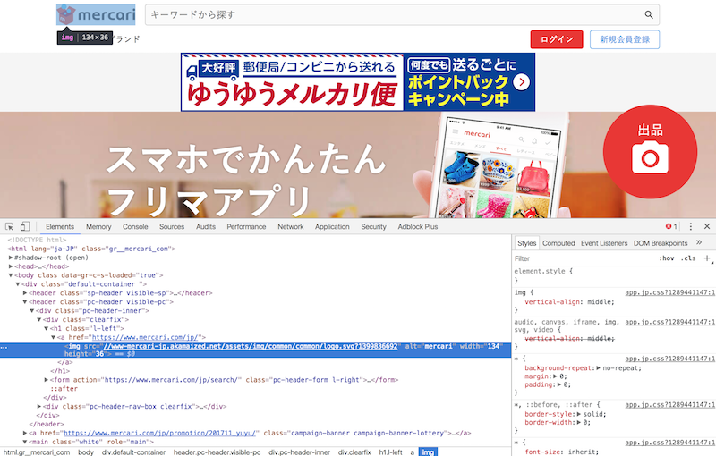

## 色々なWebサイトのHTMLを見てみる

Google ChromeにはDevToolsという開発者向けの機能がついています。この機能を利用するとWebサイトのHTMLやCSSなどを見ることが出来ます。実際に有名サイトでどのようにHTMLが書かれているのか見てみると、勉強になるはずです。

[Chrome DevToolsの使い方](https://developers.google.com/web/tools/chrome-devtools/?hl=ja)

例えば、メルカリのHTMLを見てみましょう。

[メルカリ](https://www.mercari.com/jp/)

DevToolsを立ち上げると以下のような画面が出てきます。

この出てきた画面の左側の部分がHTMLです。いかがでしょうか。複雑ではあるもののどんなサイトであればHTMLで出来ていることが分かるはずです。